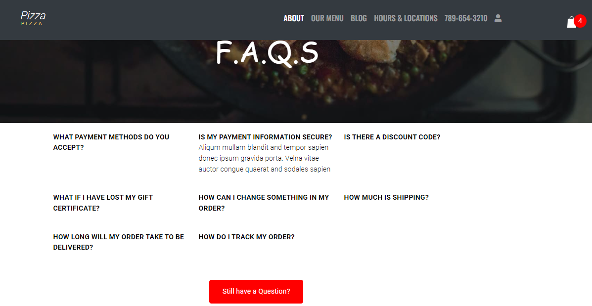
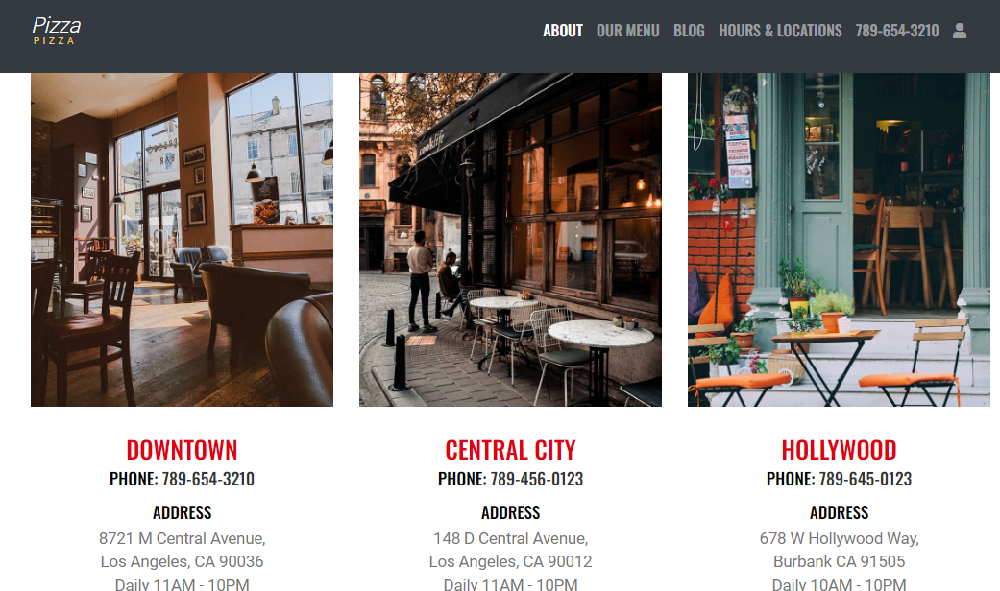

# E-commerce website with HTML, CSS, Bootstrap, JavaScript

## Features
* functional menu with filtering and add product capabilities
* product details page for each product
* functional shopping cart with add, remove, delete capabilities
* FAQS
* Booking and Contact us forms
* Sign in and sign up page

## Deployed website
[pizzaforpizza](https://pizzaforpizza.netlify.app/index.html)

## Images

